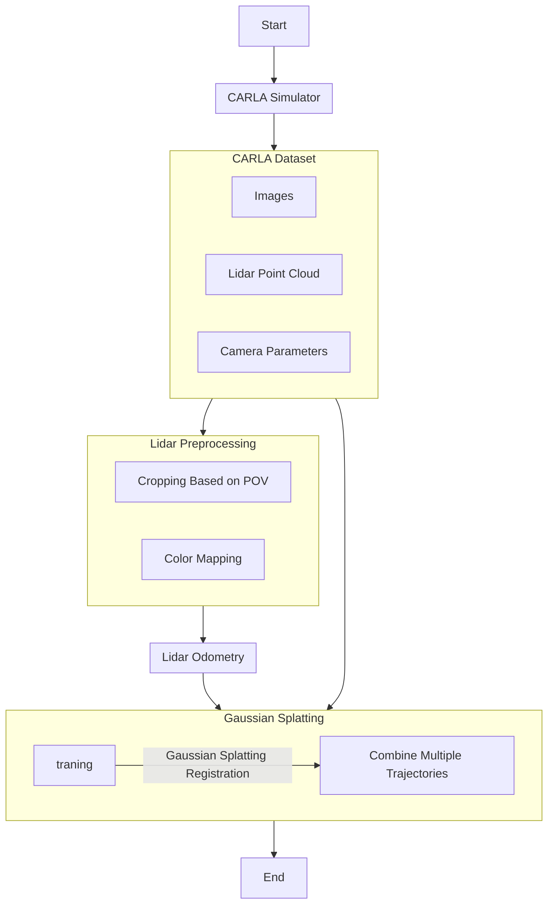

# CARLA2NMR Viewer

CARLA2NMR Viewer is an application designed to support the visualization of data in COLMAP format, including LiDAR point clouds and camera poses. This viewer application also supports cropped LiDAR point clouds (based on camera POV), Gaussian SLAM (in progress), and LiDAR odometry using KISS-ICP.

## Features

- **COLMAP Format Support**: Load and visualize data in COLMAP format.
- **LiDAR Point Cloud Visualization**: Display full LiDAR point clouds as well as cropped point clouds based on camera POV.
- **Camera Pose Visualization**: Show camera poses from the loaded data.
- **Gaussian SLAM**: In-progress feature to support Gaussian SLAM.
- **KISS-ICP LiDAR Odometry**: LiDAR odometry using KISS-ICP.
- **Gaussian Splatting Training**: Gaussian Splatting Training with [gsplat](https://github.com/nerfstudio-project/gsplat) backend.

## Usage
This project requires Python 3.8+. To run the application, follow the steps below:
1. Clone the repository:
```bash
git clone https://github.com/zhumorui/CARLA2NMR.git
```
2. Navigate to the repository directory:
```bash
cd CARLA2NMR
```
3. Installation:
```bash
pip install -r requirements.txt
```
4. Install kiss-icp Python API:
```bash
git clone git@github.com:zhumorui/kiss-icp.git
cd kiss-icp
make editable 

```

5. Run the app:
```bash
python src/main.py
```

## Workflow



## Demo
1. Visualize images and camera poses. 
<p align="center">
  
</p>

2. Lidar odometry with kiss-icp method.
<p align="center">
  
</p>

3. Gaussian Splatting training with gsplat backend.
<p align="center">
  
</p>


## Acknowledgements
I thank the authors of the following repositories for their contributions to this project:
- [viser](https://viser.studio/latest/)
- [gsplat](https://github.com/nerfstudio-project/gsplat)
- [colmap](https://github.com/colmap/colmap)
- [kiss-icp](https://github.com/PRBonn/kiss-icp)
- [nerfview](https://github.com/hangg7/nerfview)
- [Gaussian-SLAM](https://github.com/VladimirYugay/Gaussian-SLAM)
